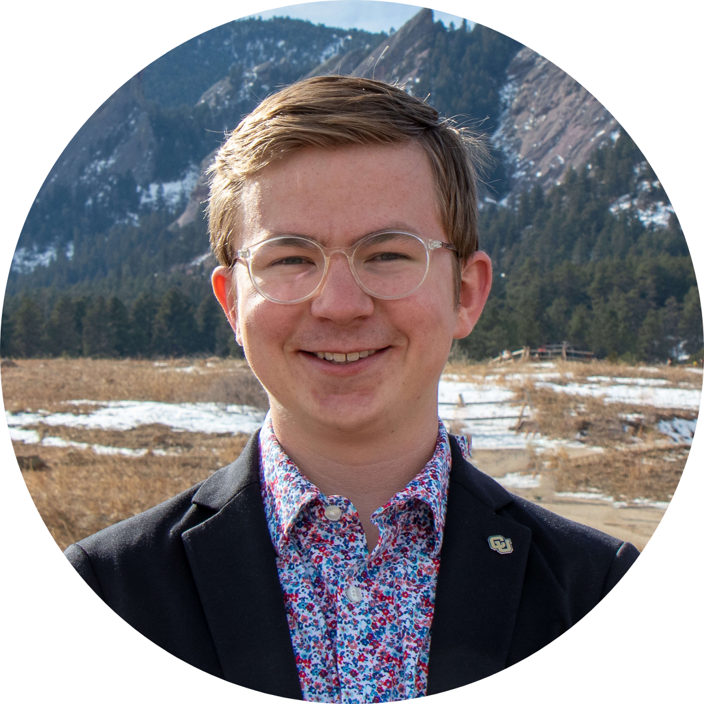

## About Me

Hi! I am a recent graduate of the University of Colorado Boulder with a B.A. in Political Science with minors in Leadership Studies and Speech, Language, Hearing Sciences. **I am actively looking for a full time role in Washington DC or elsewhere, [lets connect!]()**

## Recent Work

I was elected as External Affairs Tri-Executive and Student Body President for the 2023-24 academic year. In this role, I oversaw a cabinet of 30 student employees, the management of our $35.5 million student fee budget, and led numerous policy efforts on & off campus.

📢 served as key student representative on search committee to select CU Boulder's next Chancellor

👥 hired and led a team of 30 cabinet members to serve the student body through advocacy and policy change

🏛️ testified on more than a dozen bills in the state legislature

🏡 led student organizing to implement a statewide ban on discriminatory occupancy limits AND a ban on the concealed carry of firearms on higher education campuses

🗓️ provided insight to adjust the campus academic calendar, providing more space for student mental health and calmer finals season

🎤 hosted dozens of events promoting health, safety, sustainability, and so much more

🗳️ organized a City Council candidate debate on campus

🪑 sat on numerous committees to guide the campus' strategic enrollment management, civic and electoral engagement, microcredentialing strategies, campus police oversight, and other areas

🌳 led policy changes on campus sustainability, safety, accessibility, and others

🦺 advocated for students rights and safety, during a particularly difficult year for freedom of speech and demonstration